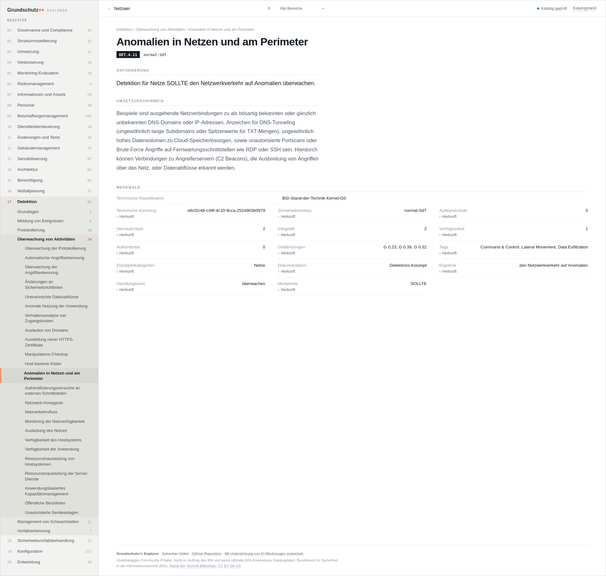

# Grundschutz++ Explorer

Liest den OSCAL-Katalog des BSI und zeigt ihn als
durchsuchbare Webseite an. Läuft im Browser, nichts
zu installieren.

→ https://sgoettel.github.io/grundschutzpp-explorer/

Kein offizielles Angebot des BSI.

[Hinweise und Rückmeldungen](https://github.com/sgoettel/sgoettel/blob/main/img/mail.png)
